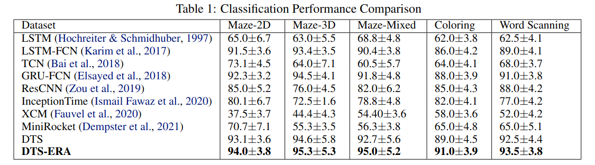

# DTS-ERA
## Intro
This repository contains the source code implementation for our submission paper **Deep Temporal Sets with Evidential Reinforced Attentions for Unique Behavioral Pattern Discovery**
The python file RAM_ASD_TD_mean_train_test.py are the core framework codes to run this project under different settings, by integrating training code and evaluation code all in one file.

## Installation
Generate conda environment using ADS.yml file, then run the RAM_ASD_TD*.py to try different RAM model variants (one for mean, one for concatenation).
For recovering main results in the paper, just run RAM_ASD_TD_mean_train_test.py
About how to build conda environment using *.yml files. Please refer to this [link](https://conda.io/projects/conda/en/latest/user-guide/tasks/manage-environments.html).

## Dependencies
+ See ADS.yml file.

## Dataset
+ See data/maze for processed version of Maze dataset. For the original dataset of Maze, Wording Scanning and Coloring datasets, please ask authors for permission.

## Pre-trained Models
+ See results/checkpoint
   
## Baselines Result
For baseline result comparison, users can easily reproduce them by running the RAM_ASD_TD_mean_train_test.py and replacing the main model RAM_ASD_TD_mean with any baselines. (e.g. GRU-LSTM, XCM, etc)

